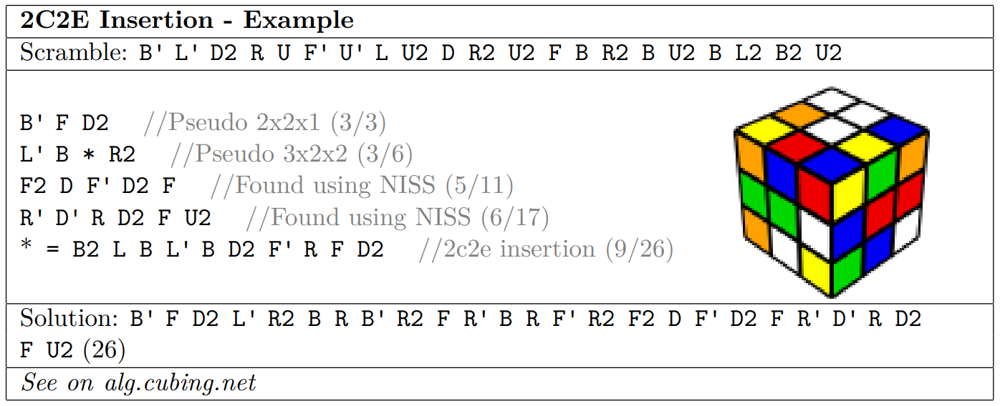

## やりたいこと
{:class="img-responsive"}
オリジナルのFMCチュートリアルでは、さまざまな実例を用いて解説を進めていきます。そこで重要なパーツが、ソルブ実例の表示用ボックスです。**タイトル、スクランブル、解法の解説、キューブの画像、まとめた解法、alg.cubing.netへのリンクがコンパクトにまとまっています。**これをMarkdown+Jekyllでうまく再現する方法を考えてみます。

## 実装
### １．手順をテキストとして与える
テスト用のソルブ表示ボックスを表示します。まずはボックスを表示するために、表示されるテキストを準備します。このテキストはliquidで処理され、`<pre>`タグで囲まれて表示されます。``を用いてテキストをliquidに与えます。

```

B' F D2 //Pseudo 2x2x1 (3/3)
L' B * R2 //Pseudo 3x2x2 (3/6)
F2 D F' D2 F //Found using NISS (5/11)
R' D' R D2 F U2 //Found using NISS (6/17)
* = B2 L B L' B D2 F' R F D2 //2c2e insertion (9/26)

```


### ２．ボックス作成用のhtmlファイルをインクルードする
liquidのinclude構文を利用して、下記のように呼び出します。  
引数として、上記のtextに加えて`title`、`scramble`、`solution`、`img_src`、`algcubing`を与えます。画像ファイルはalg.cubing.netにスクランブルを入力して生成したものをローカルにダウンロードして利用します。あわせて手順を一手ずつ追いかけられるように、alg.cubing.netへのリンクを作成します。

```
{% include solvebox.html
title = "2C2E Insertion - Example"
scramble = "B' L' D2 R U F' U' L U2 D R2 U2 F B R2 B U2 B L2 B2 U2"
text = display_text
solution = "B' F D2 L' R2 B R B' R2 F R' B R F' R2 F2 D F' D2 F R' D' R D2 F U2 (26)"
img_src="../assets/img/2C2E_alg.png
algcubing = "https://alg.cubing.net/?setup=B-_L-_D2_R_U_F-_U-_L_U2_D_R2_U2_F_B_R2_B_U2_B_L2_B2_U2&alg=B-_F_D2_%2F%2FPseudo_2x2x1_(3%2F3)%0AL-_B_(B2_L_B_L-_B_D2_F-_R_F_D2)_R2_%2F%2FPseudo_3x2x2_(3%2F6)%0AF2_D_F-_D2_F_%2F%2FFound_using_NISS_(5%2F11)%0AR-_D-_R_D2_F_U2_%2F%2FFound_using_NISS_(6%2F17)"
%}
```


### ３．インクルード先を作成する
最後に、インクルード先のhtml側でボックスを作成します。
```html
<div class="solvebox clearfix shadow-sm">
    <h2>{{ include.title }}</h2>
    <div class="solvetext scramble">スクランブル: {{ include.scramble }}</div>
    
    <div class="solvetext clearfix shadow-none"><pre class="shadow-none">{{ include.text }}</pre></div>
    
        
        <div class="solvetext solution">ソリューション: <a href = "{{ include.algcubing }}">{{ include.solution }}</a></div>
        
        <div class="solvetext solution">ソリューション: {{ include.solution }}</div>
        
    
</div>
```
### ４．cssを定義する
同時にcssも定義しておきます。基本的な外観はminimal-mistakesのテーマのものと、bootstrapのテーマを利用していますので、少しこのボックスに関する修正をするだけで終わります。
```css
.solvebox h2{
    margin: 0.5em 0 0;
    border-bottom: double 1px rgb(65, 65, 65);
}

.solvebox .scramble{
    border-bottom: solid 1px rgb(65, 65, 65);
}

.solvebox .solution{
    border-top: solid 1px rgb(65, 65, 65);
}
```


## 表示結果
このコードを処理させると、次のようなボックスが表示されます。

B' F D2 //Pseudo 2x2x1 (3/3)
L' B * R2 //Pseudo 3x2x2 (3/6)
F2 D F' D2 F //Found using NISS (5/11)
R' D' R D2 F U2 //Found using NISS (6/17)
* = B2 L B L' B D2 F' R F D2 //2c2e insertion (9/26)

{% include solvebox.html
title = "2C2E Insertion - Example"
scramble = "B' L' D2 R U F' U' L U2 D R2 U2 F B R2 B U2 B L2 B2 U2"
text = display_text
solution = "B' F D2 L' R2 B R B' R2 F R' B R F' R2 F2 D F' D2 F R' D' R D2 F U2 (26)"
img_src="../assets/img/2C2E_alg.png"
algcubing = "https://alg.cubing.net/?setup=B-_L-_D2_R_U_F-_U-_L_U2_D_R2_U2_F_B_R2_B_U2_B_L2_B2_U2&alg=B-_F_D2_%2F%2FPseudo_2x2x1_(3%2F3)%0AL-_B_(B2_L_B_L-_B_D2_F-_R_F_D2)_R2_%2F%2FPseudo_3x2x2_(3%2F6)%0AF2_D_F-_D2_F_%2F%2FFound_using_NISS_(5%2F11)%0AR-_D-_R_D2_F_U2_%2F%2FFound_using_NISS_(6%2F17)"
%}

画像もレスポンシブに回り込んでくれるし、悪くない出来です。画像サイズをもう少し動的に変化させたほうがモバイルでは見やすい場合があるかもしれません。

FMC Tutorialの翻訳中に出てくるボックスはこの形で表示できるようにします。これで少し翻訳が楽になるかな？